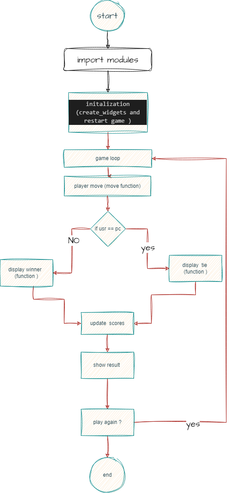
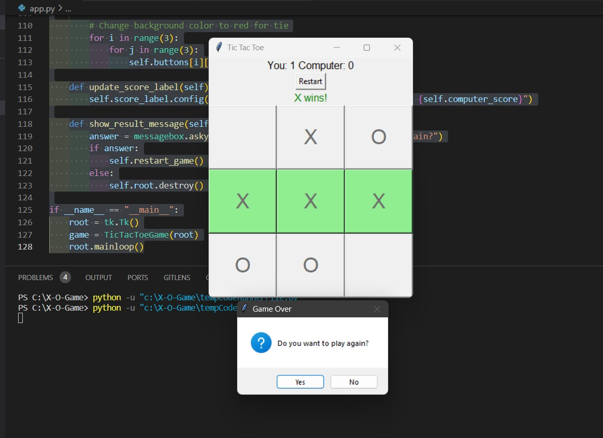
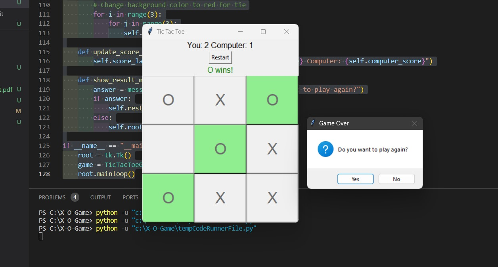
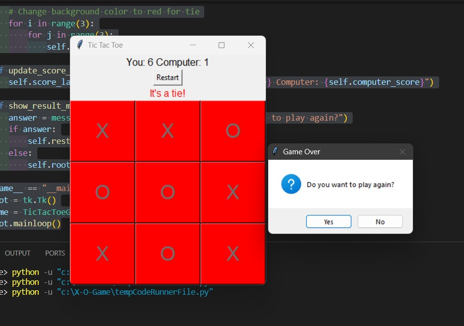

# Tic-Tac-Toe Game

## Description

This is a simple implementation of the classic Tic-Tac-Toe game using Python and the Tkinter GUI framework. The game allows you to play against a computer opponent that makes random moves.

## [Video Demonstration:](https://clipchamp.com/watch/E0AUm6ZKZ1N)

## Planning





## Features

- Player vs. Computer gameplay.
- Simple and intuitive GUI using Tkinter.
- Score tracking for the player.
- Random move generation for the computer opponent.
- Easy-to-understand code structure for further customization.

## Getting Started

1. Clone the repository:

   ```bash
   git clone https://github.com/MMansy19/X-O-Game.git
   ```

2. Navigate to the project directory:

   ```bash
   cd tic-tac-toe
   ```

3. Run the game:

   ```bash
   python tic_tac_toe.py
   ```

## How to Play

- The game starts with the player as "X" and the computer as "O".
- Click on an empty cell to make a move.
- The game alternates between the player and the computer until there is a winner or a draw.
- The player's score is displayed at the bottom of the window.

## Screenshots

### X Wins


### O Wins


### Draw Announcement



## Author

- Mahmoud Mansy

## License

This project is licensed under the MIT License - see the [LICENSE](LICENSE) file for details.

## Acknowledgments

- Thanks to the Tkinter library for providing a simple and powerful GUI framework for Python.
- Special thanks to [OpenAI](https://www.openai.com/) for inspiring the project.

---

**X-O** - A Tic-Tac-Toe Game by Mahmoud Mansy ([GitHub](https://github.com/MMansy19))
